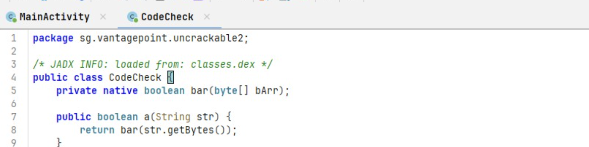
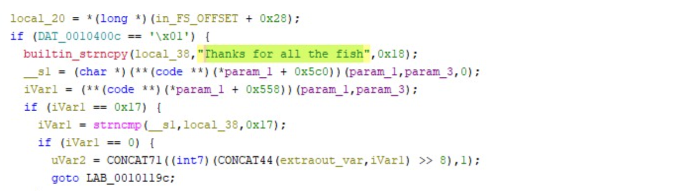
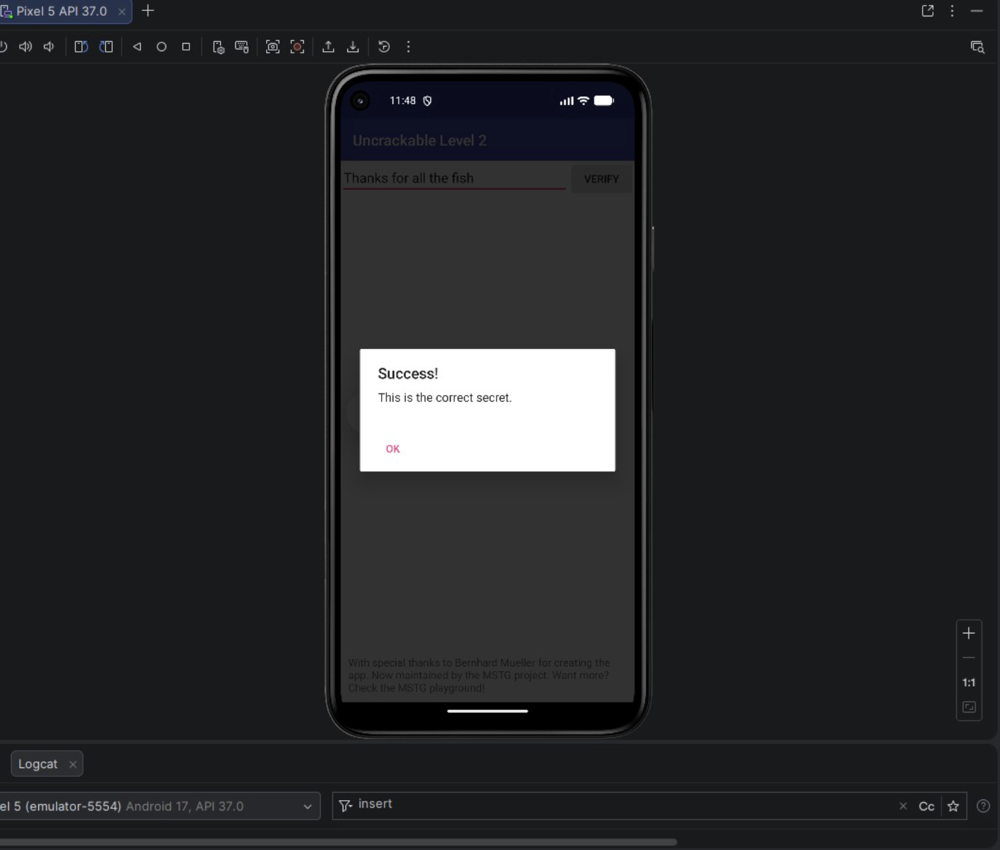

# Android Native Code Analysis — OWASP UnCrackable Level 2

> **Security lab** — Static and dynamic analysis of an Android APK that hides its verification logic inside a native JNI library.  
> APK source: [OWASP MASTG Crackmes](https://mas.owasp.org/crackmes/Android/)  
> Tools: ADB, JADX, Ghidra, Android Emulator

---

## Table of Contents

1. [Objective](#objective)
2. [Tools & Environment](#tools--environment)
3. [Part 1 — Running the App](#part-1--running-the-app)
4. [Part 2 — Java Layer Analysis (JADX)](#part-2--java-layer-analysis-jadx)
5. [Part 3 — The CodeCheck Class](#part-3--the-codecheck-class)
6. [Part 4 — Unpacking the APK](#part-4--unpacking-the-apk)
7. [Part 5 — Native Library Analysis (Ghidra)](#part-5--native-library-analysis-ghidra)
8. [Part 6 — Understanding the Comparison Logic](#part-6--understanding-the-comparison-logic)
9. [Result](#result)
10. [Security Findings](#security-findings)
11. [Key Takeaways](#key-takeaways)

---

## Objective

UnCrackable Level 2 raises the bar compared to Level 1. The secret is no longer sitting in Java code as a hardcoded string — it has been moved into a **native shared library** (`.so` file) compiled from C/C++. The goal is to locate and analyze this library, reverse engineer the verification function, and recover the secret without ever guessing.

This lab demonstrates why JNI (Java Native Interface) is not a reliable security boundary — native code is still fully reversible with the right tools.

---

## Tools & Environment

| Tool | Purpose |
|---|---|
| ADB (Android Debug Bridge) | Install APK, interact with emulator |
| Android Emulator (Pixel 5, API 37) | Run the application |
| JADX | Decompile the Java/DEX layer |
| Ghidra | Reverse engineer the native `.so` library |
| unzip | Extract APK contents |

---

## Part 1 — Running the App

### Installation

```bash
adb install UnCrackable-Level2.apk
```

### Observation

The app presents a single text field and a VERIFY button. Testing arbitrary inputs (`test`, `1234`, `hello`, `password`) always returns a failure dialog — **"That's not it"**.

This tells us:
- A comparison is happening somewhere
- The app has a fixed expected value it checks against
- The logic is not trivially visible

The next step is to find where that comparison lives.

---

## Part 2 — Java Layer Analysis (JADX)

Open the APK in JADX: **File → Open file → UnCrackable-Level2.apk**

Navigate to: `Source code → sg.vantagepoint.uncrackable2 → MainActivity`

### What MainActivity does

The verify button handler reads the user input and passes it to another object:

```java
public void verify(View view) {
    String obj = ((EditText) findViewById(R.id.edit_text)).getText().toString();
    if (this.m.a(obj)) {
        // success
    } else {
        // failure
    }
}
```

`this.m` is an instance of the `CodeCheck` class. The actual comparison is fully delegated — `MainActivity` itself contains no secret, no key, no comparison logic. It is purely a UI wrapper.

---

## Part 3 — The CodeCheck Class

Navigate to: `Source code → sg.vantagepoint.uncrackable2 → CodeCheck`



```java
public class CodeCheck {
    private native boolean bar(byte[] bArr);

    public boolean a(String str) {
        return bar(str.getBytes());
    }
}
```

This is where the trail goes cold in Java. Two things happen here:

1. The user input string is converted to a `byte[]`
2. It is passed to `bar()` — a **native method**, declared with the `native` keyword

The `native` keyword means the implementation is **not in Java** — it lives in a compiled C/C++ shared library loaded at runtime via `System.loadLibrary()`. JADX cannot decompile it. We need a different tool entirely.

---

## Part 4 — Unpacking the APK

Since an APK is just a ZIP archive, we can extract it directly to find the native libraries:

```bash
unzip UnCrackable-Level2.apk -d uncrackable2_unpacked
ls uncrackable2_unpacked/lib/
```

The `lib/` directory contains compiled binaries for multiple CPU architectures:

```
lib/
├── armeabi-v7a/
│   └── libfoo.so
├── x86/
│   └── libfoo.so
```

The file we want is **`libfoo.so`** — the library that implements the `bar()` function called by `CodeCheck`. We will use the `x86` version since we are running on an x86 emulator, but both contain the same logic.

---

## Part 5 — Native Library Analysis (Ghidra)

### Import into Ghidra

1. Open Ghidra → New Project → Import `libfoo.so`
2. Run auto-analysis (accept defaults)
3. Wait for analysis to complete

### Finding the JNI function

JNI functions follow a strict naming convention:
```
Java_<package>_<class>_<method>
```

For our `bar()` method in `sg.vantagepoint.uncrackable2.CodeCheck`, the native function is named:
```
Java_sg_vantagepoint_uncrackable2_CodeCheck_bar
```

Search for it in Ghidra: **Search → Symbol Table** → search `bar` or `CodeCheck`.

### Decompiled output



```c
local_20 = *(long *)(in_FS_OFFSET + 0x28);
if (DAT_0010400c == '\x01') {
    builtin_strncpy(local_38, "Thanks for all the fish", 0x18);
    __s1 = (char *)(**(code **)(*param_1 + 0x5c0))(param_1, param_3, 0);
    iVar1 = (**(code **)(*param_1 + 0x558))(param_1, param_3);
    if (iVar1 == 0x17) {
        iVar1 = strncmp(__s1, local_38, 0x17);
        if (iVar1 == 0) {
            // success path
            goto LAB_0010119c;
        }
    }
}
```

The secret is right there in plain sight: **`"Thanks for all the fish"`**

---

## Part 6 — Understanding the Comparison Logic

The native function does the following:

```
1. Copy the expected secret into a local buffer: "Thanks for all the fish"
2. Get the user input string via JNI call
3. Check that the length == 0x17 (23 characters)
4. Run strncmp(user_input, secret, 23)
5. If strncmp returns 0 → strings are equal → return true
```

`strncmp(s1, s2, n)` returns `0` if the first `n` characters of both strings are identical. The length check (`iVar1 == 0x17`) acts as an early rejection before the comparison — inputs of wrong length are rejected immediately without calling `strncmp`.

The secret `"Thanks for all the fish"` is 23 characters long — exactly `0x17` in hex.

---

## Result



Entering **`Thanks for all the fish`** in the application triggers the success dialog:

> **Success! — This is the correct secret.**

Secret recovered entirely through static reverse engineering — no runtime tampering, no patching, no Frida.

---

## Security Findings

### Finding #1 — Secret stored in plaintext inside native library
| | |
|---|---|
| **Severity** | 🔴 High |
| **Location** | `libfoo.so` → `Java_sg_vantagepoint_uncrackable2_CodeCheck_bar` |
| **Description** | The expected secret string `"Thanks for all the fish"` is stored as a plaintext literal in the compiled native library. Ghidra's decompiler recovers it immediately during auto-analysis. |
| **Impact** | Any analyst with Ghidra (free tool) can recover the secret in under 10 minutes without executing the app. |
| **Remediation** | Never store secrets as string literals in native code. Use a challenge-response protocol with a backend server — the client should never possess the reference value. |

---

### Finding #2 — JNI used as a false security boundary
| | |
|---|---|
| **Severity** | 🔴 High |
| **Location** | `CodeCheck.java` → `private native boolean bar(byte[] bArr)` |
| **Description** | The developer moved the verification logic from Java into a native library, likely with the intent of making it harder to reverse. This is security through obscurity — native code adds a layer of difficulty but does not prevent analysis. |
| **Impact** | Ghidra, IDA Pro, and Binary Ninja all handle ARM/x86 `.so` files routinely. The added friction is minimal for anyone with basic reverse engineering skills. |
| **Remediation** | Treat native code as equally readable as Java. The only real protection is server-side validation — secrets that never leave the server cannot be extracted from the client. |

---

### Finding #3 — Client-side validation architecture
| | |
|---|---|
| **Severity** | 🔴 High |
| **Location** | Full application architecture |
| **Description** | Like Level 1, the entire verification flow runs on the client. The correct answer exists within the APK and can be found without network access, without a running device, and without any interaction with the app. |
| **Impact** | The "protection" provides zero security — it only creates inconvenience for casual users, not for any motivated analyst. |
| **Remediation** | Secret verification must be server-side. The app should send the input to an authenticated API endpoint that returns a pass/fail response — the server never reveals the secret itself. |

---

### Finding #4 — No obfuscation on the native function name
| | |
|---|---|
| **Severity** | 🟠 Medium |
| **Location** | `libfoo.so` symbol table |
| **Description** | The JNI function retains its full unmangled name `Java_sg_vantagepoint_uncrackable2_CodeCheck_bar` in the symbol table, making it trivially locatable in Ghidra. |
| **Impact** | An analyst can jump directly to the verification function without any search effort. |
| **Remediation** | Use `RegisterNatives()` at runtime instead of the standard naming convention — this removes the exported symbol name. Combine with symbol stripping (`strip` tool) and LLVM obfuscation passes for additional friction. Note: this is still not a real security control, only raises the bar slightly. |

---

## Key Takeaways

| Level 1 | Level 2 |
|---|---|
| Secret in Java bytecode | Secret in native C library |
| Recovered with JADX alone | Requires Ghidra + JADX |
| AES/ECB + hardcoded key | Plaintext string + strncmp |
| Pure static analysis | Static analysis of `.so` |
| ~5 minutes | ~15 minutes |

Both crackmes fall to the same root cause: **the secret exists on the client**. Moving it from Java to C buys a few extra minutes of analyst time — nothing more.

The only architecturally sound protection is to remove the secret from the client entirely and validate server-side. Everything else is obfuscation.

---

*Lab conducted in a strictly educational context on an OWASP-provided sample application designed for this purpose.*
